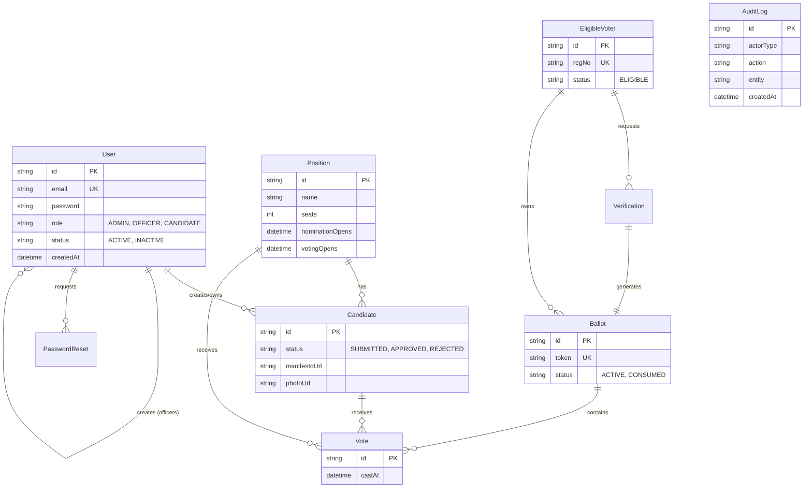

# Entity Relationship Diagram (ERD)

**Project:** University E-Voting System (Backend)  
**Database:** MySQL (via Prisma ORM)

---

## 1. ERD Diagram (Mermaid)

---

## 2. Data Dictionary

### 2.1 User Management
| Table | Description | Key Fields |
| :--- | :--- | :--- |
| **User** | System users with login credentials. Includes Admins, Returning Officers, and Candidates. **Note:** Voters are NOT stored here. | `role`: Enum (ADMIN, OFFICER, CANDIDATE) `email`: Unique login identifier |
| **EligibleVoter** | The registry of students eligible to vote. Imported via CSV. | `regNo`: Unique Registration Number (e.g., S21/001) `status`: Eligibility status |

### 2.2 Election Configuration
| Table | Description | Key Fields |
| :--- | :--- | :--- |
| **Position** | Elective posts (e.g., Guild President, GRC). | `nominationOpens`: Start of candidate registration `votingOpens`: Start of election |
| **Candidate** | Students running for a specific Position. Linked to a User account. | `status`: Approval workflow (SUBMITTED -> APPROVED) `manifestoUrl`: Link to PDF manifesto |

### 2.3 Voting Process
| Table | Description | Key Fields |
| :--- | :--- | :--- |
| **Verification** | OTP records for voter authentication. | `otpHash`: Hashed OTP for security `expiresAt`: Validity window (5 mins) |
| **Ballot** | Represents a verified voter's right to vote. | `token`: Single-use secure token `status`: ACTIVE (Unused) or CONSUMED (Used) |
| **Vote** | Individual votes cast for candidates. Anonymized (linked to Ballot, not Voter). | `ballotId`: Proof of valid vote `positionId`: The contest being voted for |

### 2.4 System & Security
| Table | Description | Key Fields |
| :--- | :--- | :--- |
| **AuditLog** | Immutable record of all critical system actions. | `actorType`: Who did it (Admin, System, etc.) `action`: What they did (e.g., "APPROVED_CANDIDATE") |
| **PasswordReset** | Tracks password recovery requests for Users. | `otpHash`: Secure reset code |

---

## 3. Key Relationships & Cardinality

1.  **User (Admin) 1:N User (Officer)**
    *   An Admin can create multiple Returning Officer accounts.
2.  **User (Candidate) 1:N Candidate (Nomination)**
    *   A User can submit nominations for different positions (though business logic usually limits to 1 active).
3.  **Position 1:N Candidate**
    *   A Position (e.g., President) has multiple Candidates competing.
4.  **EligibleVoter 1:N Verification**
    *   A Voter can request multiple OTPs (e.g., if the first expires).
5.  **Verification 1:1 Ballot**
    *   One successful Verification generates exactly one Ballot token.
6.  **Ballot 1:N Vote**
    *   A single Ballot contains multiple Votes (one for each Position on the ballot).

---

## 4. Database Constraints

*   **Unique Email:** `users.email` must be unique.
*   **Unique RegNo:** `eligible_voters.regNo` must be unique.
*   **One Vote Per Position:** A Ballot can only have one Vote record for a given `positionId`.
*   **One Nomination Per Position:** A User can only be a Candidate for a specific Position once.
