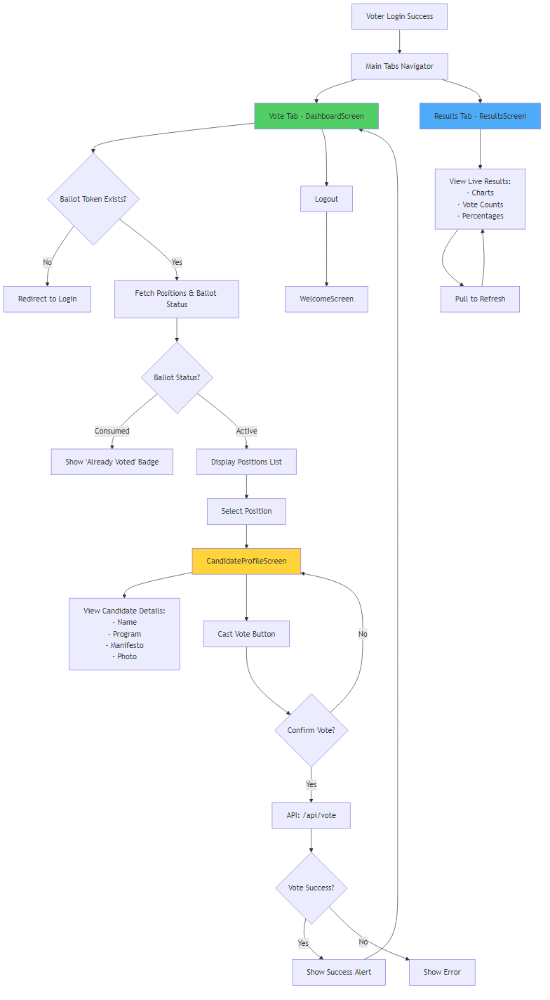
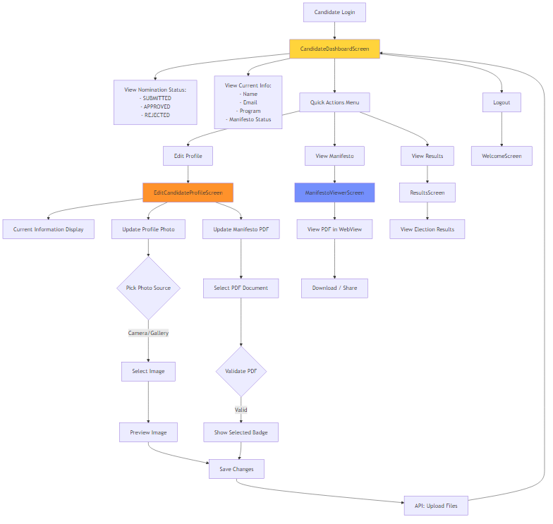
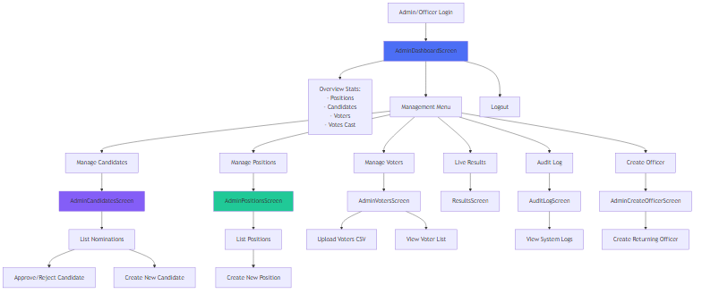
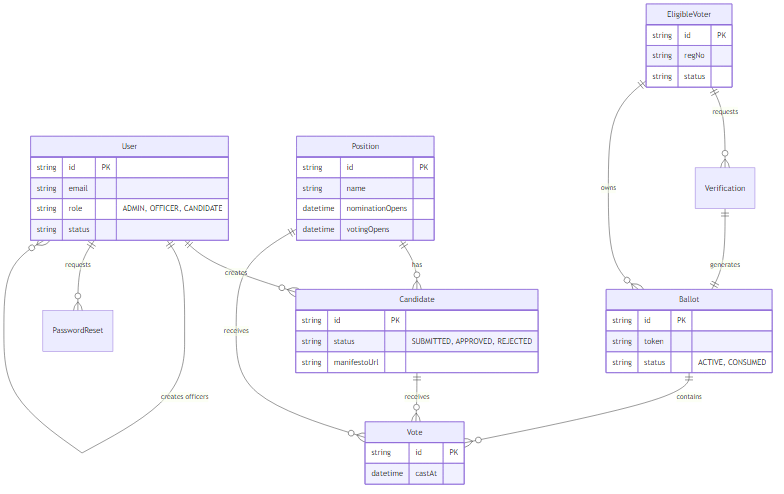
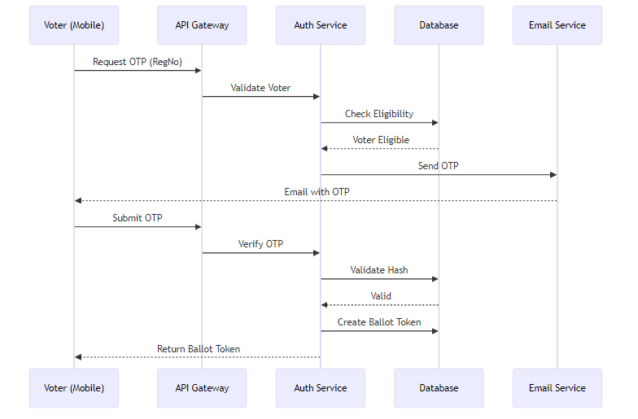
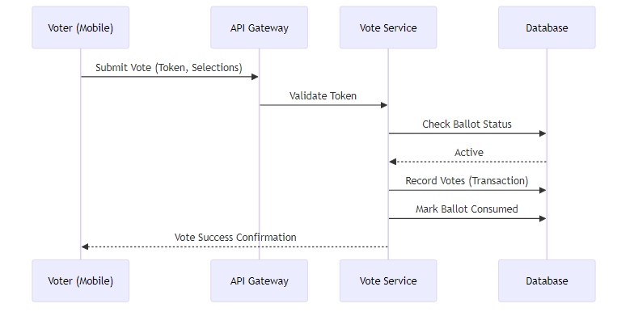

# MILESTONE ONE: Discovery & Architecture Documentation
## University E-Voting System

**Date:** December 3, 2025  
**Version:** 1.1  
**Status:** Final Draft

---

## Abstract

This document serves as the comprehensive architectural and discovery report for the University E-Voting System. It details the stakeholder analysis, user journeys, system architecture, and risk management strategies for a secure, mobile-first electronic voting platform. The system is designed to ensure transparency, security, and accessibility in university elections through role-based access control, cryptographic verification, and real-time analytics.

**Keywords:** E-Voting, System Architecture, User Journey, ERD, Risk Management, CI/CD, React Native, Node.js.

---

## 1. Introduction

### 1.1 Background
University elections are critical for student representation but often suffer from low turnout, logistical challenges, and transparency concerns when conducted manually. The University E-Voting System addresses these issues by providing a secure, accessible digital platform.

### 1.2 Objectives
-   **Security:** Ensure vote integrity and voter anonymity.
-   **Accessibility:** Enable voting from any location via mobile devices.
-   **Transparency:** Provide real-time results and immutable audit logs.
-   **Efficiency:** Streamline nomination and election management processes.

### 1.3 Scope
The project encompasses a mobile application for voters and candidates, and a web-based administration dashboard. Key features include OTP-based authentication, role-based dashboards, and real-time result visualization.

---

## 2. Stakeholder Mapping

The system identifies three primary stakeholder groups, each with distinct roles and privileges.

| Stakeholder | Role Description | Key Responsibilities |
| :--- | :--- | :--- |
| **Administrators** | System Overseers | • Manage election configuration (Positions, Dates) • Oversee user management (Officers, Voters) • Monitor system health and audit logs |
| **Returning Officers** | Election Managers | • Verify and approve candidate nominations • Monitor election conduct • Address voter issues |
| **Candidates** | Election Participants | • Submit nominations and manifestos • Campaign to voters • Monitor election results |
| **Voters** | End Users | • Verify identity via OTP • Cast secure, anonymous votes • View election results |

---

## 3. User Journeys

### 3.1 Voter Journey

### 3.2 Candidate Journey

### 3.3 Admin & Officer Journey

---

## 4. Wireframes (Key Flows)

### 4.1 Voter Authentication Flow
-   **Screen 1: Login Input**
    -   **UI Elements:** Logo, "Voter Login" title, Registration Number Input field, "Request OTP" button.
    -   **Action:** User enters Reg No and taps Request.
-   **Screen 2: OTP Verification**
    -   **UI Elements:** "Enter Verification Code" title, 6-digit Input field, "Verify & Login" button, "Resend OTP" link.
    -   **Action:** User enters code. App validates and transitions to Dashboard.

### 4.2 Voting Interface Flow
-   **Screen 1: Dashboard (Ballot)**
    -   **UI Elements:** List of Positions (e.g., President, Secretary). Progress bar (e.g., "0/5 Selected").
    -   **Action:** User taps a Position card.
-   **Screen 2: Candidate Selection**
    -   **UI Elements:** List of Candidates for selected position. Each card shows Photo, Name, Program. "View Profile" button.
    -   **Action:** User selects a candidate. Selection is highlighted.

### 4.3 Candidate Nomination Flow
-   **Screen 1: Dashboard**
    -   **UI Elements:** "My Nomination" status card. "Edit Profile" button.
    -   **Action:** User taps "Edit Profile".
-   **Screen 2: Edit Profile**
    -   **UI Elements:** Photo upload area, Name input, Manifesto upload (PDF picker), "Save Changes" button.
    -   **Action:** User uploads files and saves. Status updates to "Submitted".

### 4.4 Admin Dashboard Flow
-   **Screen 1: Overview**
    -   **UI Elements:** Stat cards (Total Voters, Votes Cast, Candidates). Quick Actions grid (Add Position, Add Officer).
    -   **Action:** Admin views high-level metrics.

---

## 5. System Architecture

### 5.1 Entity Relationship Diagram (ERD)

### 5.2 Sequence Diagrams

#### 5.2.1 Voter Authentication & Ballot Issuance

#### 5.2.2 Vote Casting

---

## 6. Risk Model

| Risk Category | Risk Description | Impact | Mitigation Strategy |
| :--- | :--- | :--- | :--- |
| **Security** | Unauthorized Access | High | Role-Based Access Control (RBAC), JWT Authentication. |
| **Security** | Voter Impersonation | High | Two-Factor Authentication (Reg No + OTP via Email). |
| **Security** | Double Voting | High | Single-use Ballot Tokens, Database constraints. |
| **Availability** | System Downtime | Medium | Load balancing, Scalable cloud infrastructure. |
| **Data Integrity** | Vote Tampering | Critical | Immutable Audit Logs, Transactional database writes. |
| **Usability** | Poor Mobile Network | Medium | Offline-first architecture considerations, Optimized API payloads. |

---

## 7. CI/Git Setup & Development

### 7.1 Version Control (Git)
-   **Repository Structure:** Two separate repositories:
    -   **Backend API:** [Evoting-Backend-API](https://github.com/JDanielZ5G/Evoting-Backend-API.git)
    -   **Mobile App:** [Evoting_mobile_group3](https://github.com/JDanielZ5G/Evoting_mobile_group3.git)
-   **Branching Strategy:** Feature-branch workflow (e.g., `feature/auth-flow`, `fix/vote-bug`) merging into `main`.
-   **Commit Convention:** Conventional Commits (e.g., `feat: add voter login`, `fix: resolve otp error`).

### 7.2 Continuous Integration (CI)
-   **Linting:** ESLint and Prettier configured for code quality.
-   **Testing:** Jest for unit testing backend logic.
-   **Build:** Expo EAS (Exchange Application Services) for mobile build generation.

---

## 8. Technologies Used

### 8.1 Mobile Client
-   **Framework:** React Native (Expo)
-   **Language:** JavaScript/TypeScript
-   **State Management:** React Hooks, Context API
-   **Storage:** AsyncStorage (Local persistence)
-   **Networking:** Axios

### 8.2 Backend Server
-   **Runtime:** Node.js
-   **Framework:** Express.js
-   **Database:** MySQL
-   **ORM:** Prisma
-   **Authentication:** JSON Web Tokens (JWT), Bcrypt

---

## 9. Future Plans

-   **Biometric Authentication:** Integration of FaceID/TouchID for faster voter login.
-   **Blockchain Integration:** Storing vote hashes on a public ledger for ultimate transparency.
-   **Push Notifications:** Real-time updates for candidates and voters (e.g., "Voting is now open").
-   **Multi-Language Support:** Localization for diverse student bodies.

---

## 10. References
1.  React Native Documentation: https://reactnative.dev/
2.  Prisma ORM Documentation: https://www.prisma.io/docs/
3.  Expo Documentation: https://docs.expo.dev/
4.  IEEE Standard for Software System Architecture Description (IEEE 1471).
