# E-Voting Mobile App - User Journey Flowcharts

This document contains comprehensive flowcharts for all user journeys in the mobile e-voting application.

---

## 1. Initial Welcome & Authentication Flow

```mermaid
graph TD
# E-Voting Mobile App - User Journey Flowcharts

This document contains comprehensive flowcharts for all user journeys in the mobile e-voting application.

---

## 1. Initial Welcome & Authentication Flow

```mermaid
graph TD
    A[App Launch] --> B[WelcomeScreen]
    B --> C{User Type?}
    C -->|Voter| D[VoterLoginScreen]
    C -->|Staff/Candidate| E[LoginScreen]
    
    D --> F[Enter Reg No]
    F --> G[Request OTP Button]
    G --> H{Valid Reg No?}
    H -->|Yes| I[API: /verify/request-otp]
    H -->|No| F
    I --> J[Show OTP Input Field]
    J --> K[Enter OTP from Email]
    K --> L[Verify & Login Button]
    L --> M{OTP Valid?}
    M -->|Yes| N[Store Ballot Token]
    N --> O[Main Tabs - Voter]
    M -->|No| K
    
    E --> P[Enter Email & Password]
    P --> Q{Authentication}
    Q -->|Admin/Officer| R[AdminDashboard]
    Q -->|Candidate| S[CandidateDashboard]
    Q -->|Invalid| E
    
    style B fill:#ff6b6b
    style O fill:#51cf66
    style R fill:#4c6ef5
    style S fill:#ffd43b
```

---

## 2. Voter Journey

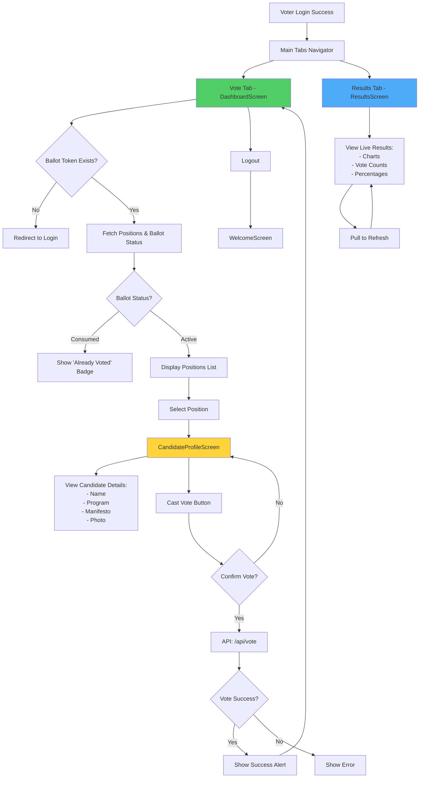

---

## 3. Candidate Journey

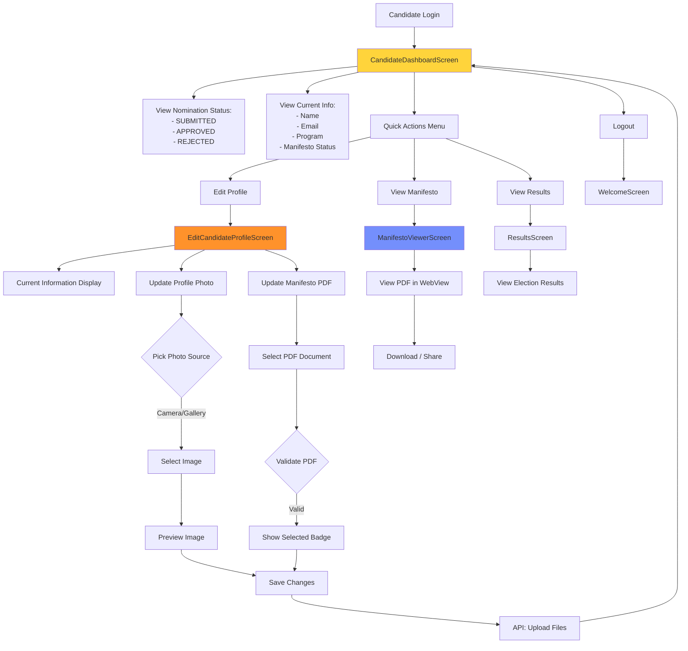

---

## 4. Admin Journey

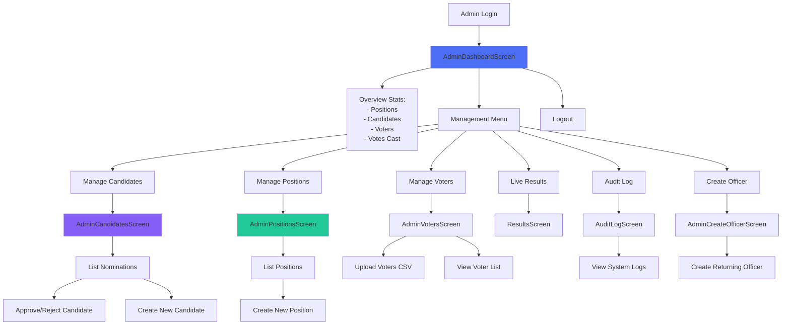

---

## 5. Officer Journey

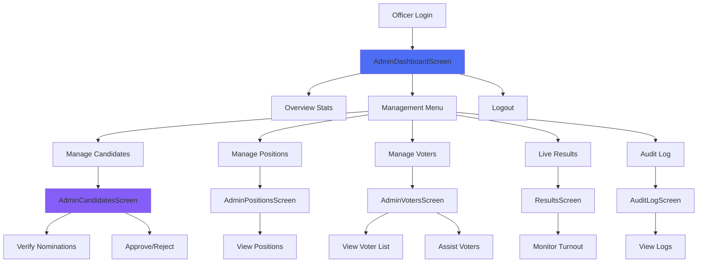

---

## 6. Navigation Structure Overview

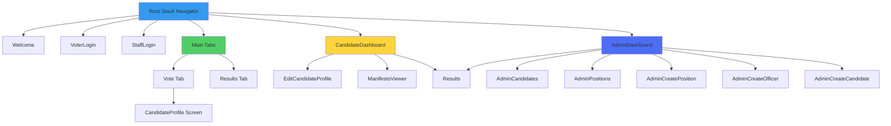

---

## 7. Complete User Flow by Role

### Voter Complete Flow

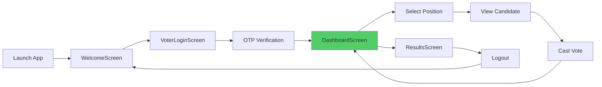

### Candidate Complete Flow

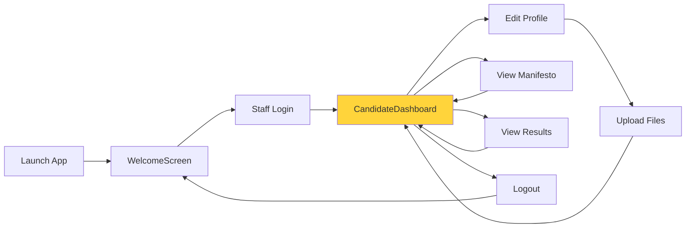

### Admin Complete Flow

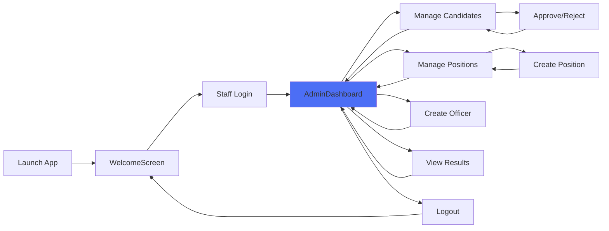

---

## 8. Screen Interaction Details

### DashboardScreen (Voter) - Detailed Flow

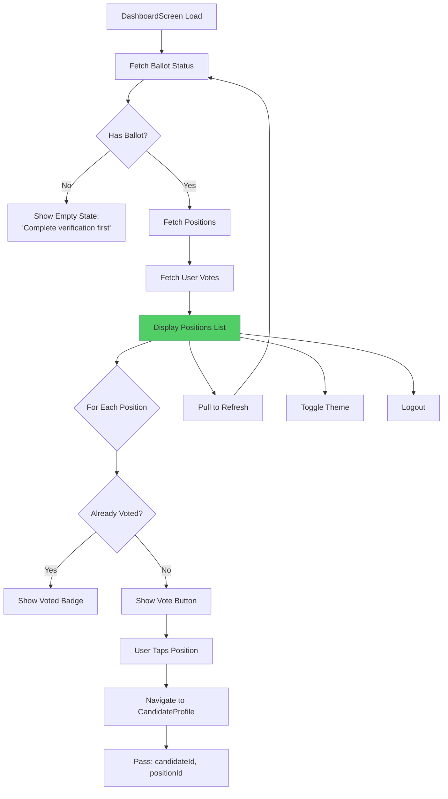

### EditCandidateProfileScreen - Detailed Flow

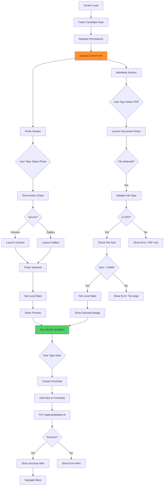

### ManifestoViewerScreen - Detailed Flow

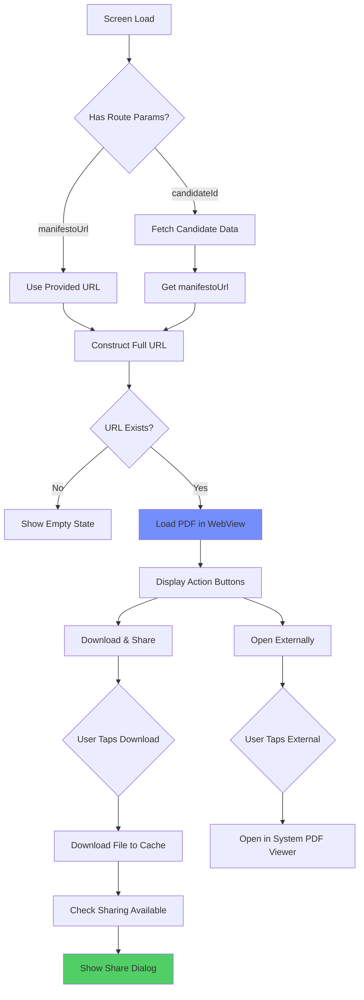

---

## 9. Data Flow Summary

### Vote Submission Flow

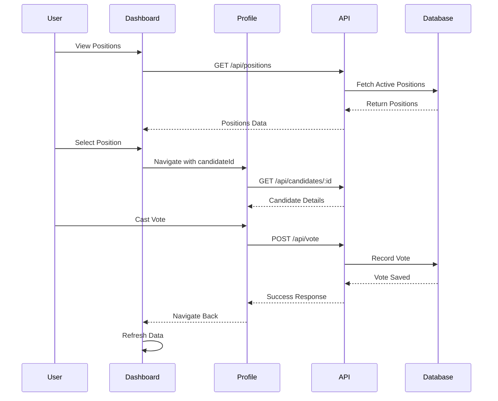

### Candidate Profile Update Flow

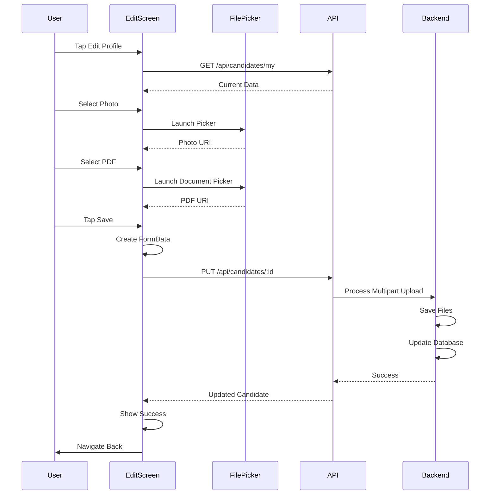

---

## 10. Screen Count Summary

| Screen Name | Route Name | User Role | Purpose |
|-------------|------------|-----------|---------|
| WelcomeScreen | Welcome | All | Initial entry point |
| VoterLoginScreen | VoterLogin | Voter | OTP-based authentication |
| LoginScreen | StaffLogin | Staff/Candidate | Email/password authentication |
| DashboardScreen | Vote (Tab) | Voter | View positions and vote |
| ResultsScreen | Results (Tab/Stack) | All | View election results |
| CandidateProfileScreen | CandidateProfile | Voter | View candidate details |
| CandidateDashboardScreen | CandidateDashboard | Candidate | Candidate portal |
| EditCandidateProfileScreen | EditCandidateProfile | Candidate | Edit profile and upload files |
| ManifestoViewerScreen | ManifestoViewer | Candidate | View/download manifesto |
| AdminDashboardScreen | AdminDashboard | Admin/Officer | Admin portal |
| AdminCandidatesScreen | AdminCandidates | Admin/Officer | Manage nominations |
| AdminPositionsScreen | AdminPositions | Admin/Officer | Manage positions |
| AdminCreatePositionScreen | AdminCreatePosition | Admin/Officer | Create new position |
| AdminCreateOfficerScreen | AdminCreateOfficer | Admin | Create officer account |
| AdminCreateCandidateScreen | AdminCreateCandidate | Admin | Create candidate nomination |
| AdminVotersScreen | AdminVoters | Admin/Officer | Manage voters list |
| AuditLogScreen | AuditLog | Admin/Officer | View system logs |

**Total Screens**: 17
